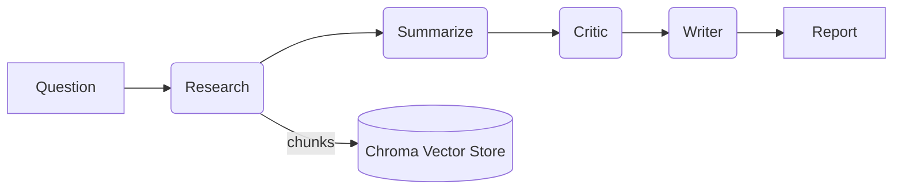

# UltraSafe FastAPI + RAG + LangGraph — Assessment Repository

A production-style implementation that satisfies both **Test A (FastAPI + RAG)** and **Test B (Multi‑Agent Research with LangGraph)** using UltraSafe’s OpenAI‑compatible APIs.

> **UltraSafe usage:** set a custom `base_url` and `api_key` in `.env` and use the OpenAI Python SDK. Do **not** hard‑code secrets.

---

## Table of Contents
- [Features](#features)
- [Repository Layout](#repository-layout)
- [Prerequisites](#prerequisites)
- [Setup](#setup)
- [Quickstart](#quickstart)
- [Configuration](#configuration)
- [Test A — FastAPI Chatbot with RAG](#test-a--fastapi-chatbot-with-rag)
  - [Architecture](#architecture)
  - [Data Ingestion](#data-ingestion)
  - [Run the API](#run-the-api)
  - [Endpoints](#endpoints)
  - [RAG Controls](#rag-controls)
  - [Evaluation](#evaluation)
- [Test B — Multi‑Agent Research (LangGraph + Advanced RAG)](#test-b--multiagent-research-langgraph--advanced-rag)
  - [Agent Roles](#agent-roles)
  - [Workflow & Orchestration](#workflow--orchestration)
  - [Run the Research Endpoint](#run-the-research-endpoint)
  - [Advanced RAG Details](#advanced-rag-details)
  - [Error Handling](#error-handling)
- [Testing](#testing)
- [Logging & Monitoring](#logging--monitoring)
- [Performance & Scaling](#performance--scaling)
- [Security Considerations](#security-considerations)
- [Design Decisions & Trade‑offs](#design-decisions--trade-offs)
- [Submission Checklist](#submission-checklist)

---

## Features
- **FastAPI** application with auth (hashed passwords + bearer token), session management, and conversation history.
- **RAG** pipeline: ingestion → hybrid retrieval (dense + BM25) → **reciprocal rank fusion** → **cross‑encoder reranker** → contextual compression → grounded answer with citations.
- **LangGraph** multi‑agent research flow: Research → Summarize → Critic → Writer with async execution.
- **Persistence**: SQLite (users/sessions/messages) + Chroma (vector store, persistent on disk).
- **Evaluation** utilities for retrieval quality (Recall@K, MRR) and examples.
- **Structured logging** with easy switches via env.
- **Tests** for API and retrieval evaluation.

---

## Repository Layout
```
ultrasafe-assessment/
├─ README.md                 # ← this file
├─ pyproject.toml
├─ .env.example
├─ config.example.yaml
├─ data/
│  ├─ support_docs/          # Test A corpora
│  └─ papers/                # Test B corpora
├─ storage/
│  └─ chroma/                # Chroma persistence
├─ app/                      # FastAPI service
├─ rag/                      # RAG core (ingestion/retrieval/eval)
├─ agents/                   # LangGraph nodes + graph
├─ tests/                    # pytest suite
└─ scripts/                  # utilities (e.g., seeding)
```

---

## Prerequisites
- Python **3.10+**
- Internet access (first run downloads the cross‑encoder model)

---

## Setup
Install dependencies:
```bash
pip install -U uvicorn fastapi pydantic sqlalchemy aiosqlite passlib[bcrypt] python-dotenv httpx
pip install -U chromadb sentence-transformers rank-bm25 numpy scikit-learn
pip install -U langgraph langchain-core
pip install -U pytest pytest-asyncio httpx[http2]
```
Create `.env` from the example and set values (see [Configuration](#configuration)).

---

## Quickstart
1) **Seed or add docs** to `data/support_docs/` (see `scripts/seed_support_docs.py`).
2) **Build the index**:
```bash
python -m rag.ingest --docs ./data/support_docs --persist ./storage/chroma
```
3) **Run the API**:
```bash
uvicorn app.main:app --reload --port 8000
```
4) **Register & login** to get a token:
```bash
curl -X POST http://localhost:8000/auth/register -H 'content-type: application/json'   -d '{"name":"tester","password":"secret"}'
TOKEN=$(curl -s -X POST http://localhost:8000/auth/login -H 'content-type: application/json'   -d '{"name":"tester","password":"secret"}' | jq -r .access_token)
```
5) **Ask a question** (RAG):
```bash
curl -X POST http://localhost:8000/chat -H "authorization: Bearer $TOKEN" -H 'content-type: application/json'   -d '{"session_id":"demo","message":"How do I reset my password?"}'
```

---

## Configuration
Environment variables (see `.env.example`):
```env
ULTRASAFE_API_KEY=***                 # do not commit secrets
ULTRASAFE_BASE_URL=https://<base>/v1  # UltraSafe OpenAI-compatible endpoint
ULTRASAFE_CHAT_MODEL=gpt-4o-mini      # chat model name as exposed by UltraSafe
ULTRASAFE_EMBED_MODEL=text-embedding-3-large
DATABASE_URL=sqlite+aiosqlite:///./app.db
CHROMA_DIR=./storage/chroma
LOG_LEVEL=INFO
```
Optional `config.example.yaml` lets you tune chunk sizes, top‑k, reranker limits, etc.

---

## Test A — FastAPI Chatbot with RAG
A customer‑support chatbot that answers **only** from your knowledge base using RAG.

### Architecture
```mermaid
flowchart LR
U[User] --> API[/FastAPI/]
API --> RET[Retriever]
RET --> DENSE[Chroma (dense ANN)]
RET --> SPARSE[BM25]
DENSE & SPARSE --> FUSE[Reciprocal Rank Fusion]
FUSE --> RERANK[Cross‑Encoder]
RERANK --> COMP[Context Compression]
COMP --> LLM[Chat Completion]
LLM --> API
API --> DB[(SQLite: users/sessions/history)]
```

### Data Ingestion
- Place Markdown/TXT/PDF in `data/support_docs/`.
- Build index:
```bash
python -m rag.ingest --docs ./data/support_docs --persist ./storage/chroma
```

### Run the API
```bash
uvicorn app.main:app --reload --port 8000
```

### Endpoints
- `POST /auth/register` – create user → `{access_token, token_type}`
- `POST /auth/login` – login → `{access_token, token_type}`
- `POST /chat` – RAG chat `{session_id, message}` → `{answer, citations[]}`
- `GET /history/{session_id}` – returns list of `{role, content}`
- `POST /rag/eval` *(optional if wired)* – compute retrieval metrics for labeled queries

### RAG Controls
Tunable in `config.example.yaml`:
- `top_k_dense`, `top_k_bm25` – candidate pool size
- `rerank_top_n` – size re‑scored by the cross‑encoder
- `final_k` – context passages used for answer synthesis
- `chunk_chars`, `chunk_overlap` – ingestion chunking parameters

### Evaluation
Use the provided evaluator to compute **Recall@K** and **MRR@K** on labeled queries.
Example JSON payload is included in the repo.

---

## Test B — Multi‑Agent Research (LangGraph + Advanced RAG)
A LangGraph‑orchestrated multi‑agent system to analyze academic papers and generate a research brief.

### Agent Roles
- **Research Agent**: retrieves the most relevant chunks.
- **Summarization Agent**: extracts key claims, methods, datasets, limitations.
- **Critic Agent**: evaluates evidence quality, confounds, and recency.
- **Writer Agent**: compiles a structured brief with inline citations where available.

### Workflow & Orchestration

The graph is compiled with **LangGraph** and run asynchronously.

### Run the Research Endpoint
Ingest your papers into `data/papers/` (or reuse the same collection for simplicity):
```bash
python -m rag.ingest --docs ./data/papers --persist ./storage/chroma
```
Call the endpoint:
```bash
curl -X POST http://localhost:8000/agents/research  -H "authorization: Bearer $TOKEN" -H 'content-type: application/json'  -d '{"question":"What are recent advances in RAG for long documents?","max_papers":6}'
```
Response shape: `{ "report": "...", "chunks": <int> }`.

### Advanced RAG Details
- **Chunking** with overlap to preserve coherence.
- **Hybrid Retrieval** (dense + BM25) fused by RRF to maximize recall.
- **Cross‑Encoder Rerank** for high precision in top‑k.
- **Contextual Compression** to fit model limits.
- **Cross‑Document Synthesis** by the Writer agent.

### Error Handling
- Node‑level retries (configurable) and clear error propagation.
- Defensive defaults for empty corpora or missing embeddings.

---

## Testing
Run the suite:
```bash
pytest -q
```
- `tests/test_api.py` – auth + chat smoke tests
- `tests/test_rag_eval.py` – retrieval metrics smoke test

---

## Logging & Monitoring
- Structured JSON logs; level via `LOG_LEVEL` (default `INFO`).
- PII redaction hooks available; extend for production.

---

## Performance & Scaling
- Keep `rerank_top_n` modest (e.g., 50) for CPU‑only runs.
- Increase `top_k_*` for broader recall; trade‑off with latency.
- For scale: move to **Postgres** (users/history) and **pgvector/Milvus** (vectors); add **Redis** for rate‑limiting and caching.

---

## Security Considerations
- Passwords are hashed with bcrypt; tokens are signed but simplified.
- Prefer **JWT/OAuth2** in production; enforce token expiry and revocation.
- Never log secrets; redact sensitive content.

---

## Design Decisions & Trade‑offs
- **Hybrid retrieval + RRF**: robust recall across heterogeneous corpora.
- **Local reranker**: predictable cost/speed; easy to swap for API rerankers.
- **Single vector store**: simpler demo; separate collections recommended at scale.

---

## Submission Checklist
- [ ] `.env.example` present; actual secrets excluded
- [ ] Clear install/run instructions (this README)
- [ ] Test A: `/chat` returns grounded answers **with citations**
- [ ] Test B: `/agents/research` returns a structured brief
- [ ] Ingestion process documented and working (Chroma persistence)
- [ ] Retrieval metrics demonstrated (Recall@K, MRR@K)
- [ ] Notes on architecture, performance, and security trade‑offs
